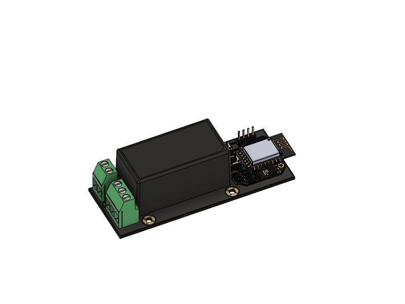
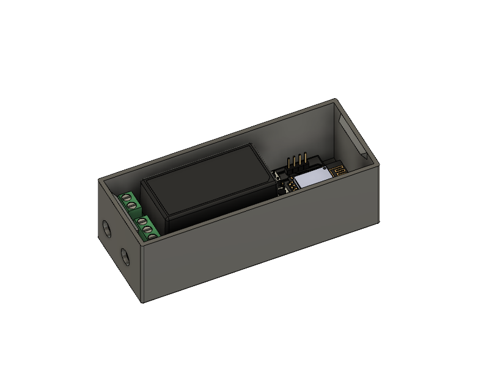
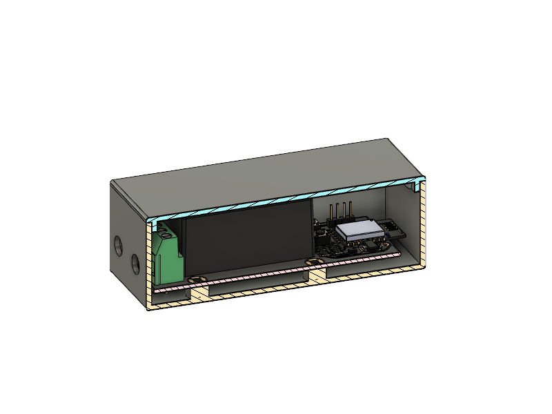

# WLED Controller for 5V LED Strips

*e.g. ws2812b, and only tested with them*

The Power supply is a 100-240VAC one and  rated at 5v 4A, don't exceed the power of the supply. Use e.g. the [WLED power calculator](https://wled-calculator.github.io/)

**As i live in germany, the pcb is only tested with 230V AC, if you supply any other voltage, be warned!**

*It can go up in flames, explode or kill you. It's main power!*

- 

**BOM**
|Reference               |Quantity|Value                                                                                                              |LCSC    |ALI                                              |
|------------------------|--------|-------------------------------------------------------------------------------------------------------------------|--------|-------------------------------------------------|
|C1 C2                   |2       |C                                                                                                                  |C107172 |[Link](https://s.click.aliexpress.com/e/_DkweKyn)|
|J1                      |1       |Conn_01x02_Male                                                                                                    |C475092 |[Link](https://s.click.aliexpress.com/e/_DC1TC2L)|
|J2                      |1       |Conn_01x03_Male                                                                                                    |C475093 |[Link](https://s.click.aliexpress.com/e/_DC1TC2L)|
|J3                      |1       |Conn_01x04_Male                                                                                                    |C2691448|[Link](https://s.click.aliexpress.com/e/_DDO0FkL)|
|Q1                      |1       |BSS138                                                                                                             |C52895  |[Link](https://s.click.aliexpress.com/e/_DF4Oc0f)|
|R1 R2 R3 R4 R5 R6 R7    |7       |10K                                                                                                                |C144471 |[Link](https://s.click.aliexpress.com/e/_Ddns0gR)|
|SW1                     |1       |SW_FLASH                                                                                                           |C393938 |[Link](https://s.click.aliexpress.com/e/_DdksuhH)|
|SW2                     |1       |SW_RESET                                                                                                           |C393938 |[Link](https://s.click.aliexpress.com/e/_DdksuhH)|
|U2                      |1       |AMS1117-3.3                                                                                                        |C5199435|[Link](https://s.click.aliexpress.com/e/_DF2uDUr)|
|U3                      |1       |ESP8266-12E/ESP-12E                                                                                                |C82891  |[Link](https://s.click.aliexpress.com/e/_DlO99yR)|
|M3 Threaded Insert      |2       |M3x5x4                                                                                                             |        |[Link](https://s.click.aliexpress.com/e/_DEReEY7)|
|ISO 7380-1 Screws       |2       |M3x6                                                                                                               |        |[Link](https://s.click.aliexpress.com/e/_Dd6fzUn)|
|U1                      |1       |[Meanwell_MPM-20-5](https://www.meanwell-web.com/en-gb/ac-dc-single-output-medical-encapsulated-power-mpm--20--5)  |        |                                                 |
|USB to Serial Converter |OPTIONAL|FT232                                                                                                              |        |[Link](https://s.click.aliexpress.com/e/_DD2GD3H)|

For the Cable Holes i added some [Rubber Cable Rings](https://www.ebay.de/itm/202766961119) with 6mm inner diameter

**Assembly**
- Order the pcb at e.g. [pcbway](https://www.pcbway.com/project/shareproject/WLED_Controller_for_5V_LED_Strips_270c2944.html) or [jlcpcb](https://jlcpcb.com/)
- While you wait, Print the casing
- Assemble the PCB
- use a soldering iron to mount your threaded inserts in the case
- mount the rubber rings, if you brought them
- Check your usb 2 serial converter that it is set to 3.3V (any other voltage will damage the esp8266)
- use the pcb pin headers to wire up the PCB with the usb 2 serial converter
```
┌────────────────────┐
│  VCC  GND  TX  RX  │
│   │    │   │ ┌──┘  │
│   │    │   └─┼──┐  │
│   │    │   ┌─┘  │  │
│   ▼    ▼   ▼    ▼  │
│  VCC  GND  TX  RX  │
└────────────────────┘
```
- while plugging in your usb2searial conveerter, hold down the FLASH button of the pcb
- go to the [WLED web installer](https://install.wled.me/) and flash your board
- setup wifi for your board
- go to the configuration website of your board, select the led setup, the output pin is **GPIO 12**
- now pull your wires through the holes in the case, wire them up to the screw terminals
- put the pcb into the case and put the lid on it


- 
- 

## Notes
- You can contact me via Discord "Gi7mo!#4618"
- This readme file contains Amazon Associate, Aliexpress affiliate, PCBWay affiliate links. I make a comission on qualifying purchases.
- This project does not come with any warranty, if you choose to build/use one, you are doing this at your own risk!
- Be Aware, it can go up in flames, explode, harm you or kill you. Mains power is dangerous!